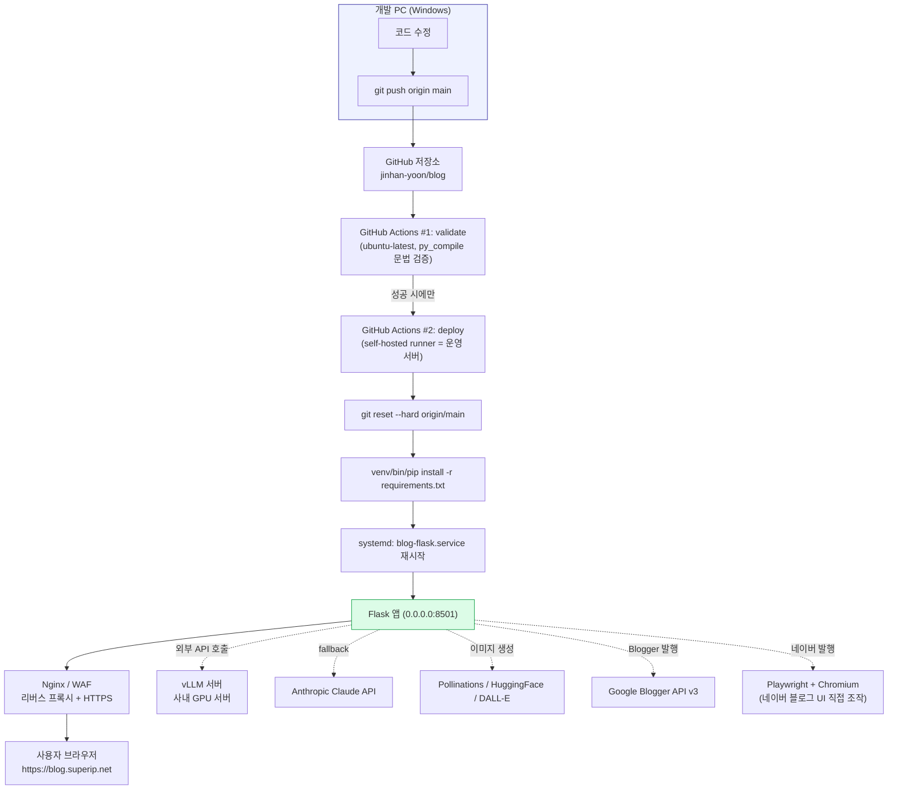
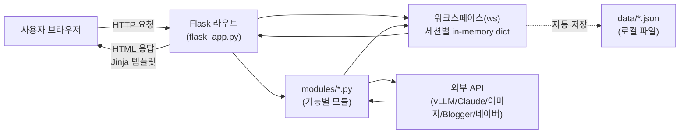

# 🤖 AI 블로그 자동화 대시보드

Google Trends → AI 콘텐츠 생성 → 이미지 생성 → Google Blogger / 네이버 블로그 발행까지 전 과정을 자동화하는 Flask 기반 웹 앱.

이 문서는 처음 보는 사람도 프로그램 구조를 이해하고, 서버에 설치하고, 화면을 사용할 수 있도록 작성되었습니다.

---

## 📑 목차

1. [전체 파이프라인](#-전체-파이프라인)
2. [아키텍처](#-아키텍처)
   - [물리 구성 (인프라)](#물리-구성-인프라)
   - [논리 구성 (앱 내부 동작)](#논리-구성-앱-내부-동작)
3. [관련 기술](#-관련-기술)
4. [프로젝트 구조](#-프로젝트-구조)
5. [서버 설치 방법](#-서버-설치-방법)
6. [로컬 개발 실행 방법](#-로컬-개발-실행-방법)
7. [환경 변수 (.env)](#️-환경-변수-env)
8. [메뉴별 사용법](#-메뉴별-사용법-초보자용)
9. [네이버 블로그 발행 설정](#-네이버-블로그-발행-설정)
10. [Google Blogger OAuth 설정](#-google-blogger-oauth-설정)
11. [앱 로그인](#-앱-로그인)
12. [이미지 생성 프로바이더](#️-이미지-생성-프로바이더)
13. [LLM 자동 Fallback](#-llm-자동-fallback)
14. [AI 감지 회피](#-ai-감지-회피-google-adsense-최적화)
15. [자주 발생하는 문제](#-자주-발생하는-문제)
16. [주요 변경 이력](#-주요-변경-이력)

---

## 🔄 전체 파이프라인

```
트렌드 수집 → 키워드 선택 → 주제 추천 → 본문 생성 → 이미지 생성 → 발행(Blogger/네이버)
 (구글/네이버)    (수동)      (vLLM/Claude) (vLLM/Claude) (Pollinations 등)  (OAuth 2.0 / Playwright)
```

이 5단계가 사이드바 메뉴(트렌드 수집 → 콘텐츠 작성 → 미디어 → 발행)와 그대로 대응됩니다.

---

## 🏛 아키텍처

### 물리 구성 (인프라)

"물리 구성"은 코드가 실제로 어떤 컴퓨터/서비스 위에서 돌아가는지를 말합니다. 이 프로젝트는 **개발 PC → GitHub → 운영 서버**로 이어지는 CI/CD 구조입니다.



**핵심 포인트**
- 배포는 `main` 브랜치에 **push하는 순간 자동 실행**됩니다 (`.github/workflows/deploy.yml`). 별도 배포 명령이 필요 없습니다.
- `validate` 단계가 실패하면(문법 오류 등) `deploy` 단계는 아예 실행되지 않아, 깨진 코드가 운영 서버에 올라가는 걸 막아줍니다.
- 실제 배포는 **self-hosted runner**(운영 서버에 직접 설치된 GitHub Actions 러너)가 수행합니다 — GitHub이 서버에 접속하는 게 아니라, 서버가 GitHub에 접속해서 작업을 받아옵니다.
- 앱은 `systemd` 서비스(`blog-flask.service`)로 등록되어 있어 서버 재부팅 시에도 자동 시작되고, 죽으면 자동 재시작됩니다(`Restart=on-failure`).
- `Restart=on-failure`는 프로세스가 **죽었을 때만** 감지합니다. 프로세스는 살아있는데 응답이 멈추는 경우(행)를 잡기 위해 `blog-healthcheck.timer`가 5분마다 `scripts/healthcheck.sh`를 실행해 `/healthz`를 호출하고, 실패하면 `blog-flask.service`를 강제 재시작합니다 — 배포 파이프라인이 매 배포마다 자동으로 등록/갱신합니다.
- vLLM, Claude, 이미지 생성, Blogger, 네이버는 전부 **외부 서비스**이며 앱은 이들을 호출하는 클라이언트 역할만 합니다 — DB 서버 같은 건 없습니다.

### 논리 구성 (앱 내부 동작)

"논리 구성"은 사용자의 클릭 한 번이 코드 안에서 어떻게 흘러가는지를 말합니다.



- **워크스페이스(`ws`)**: 로그인한 사용자마다 브라우저 쿠키(`blog_workspace_id`)로 구분되는 작업 상태(dict)입니다. 트렌드, 선택 키워드, 본문, 이미지, 발행 결과 등 "지금 작업 중인 글"의 모든 상태가 여기 담깁니다. **서버 프로세스 메모리에만 있으므로 서버가 재시작되면 사라집니다** (그래서 본문/이미지가 생길 때마다 `data/`에 자동 저장됩니다).
- **modules/**: 기능별로 분리된 순수 로직 계층입니다. Flask 라우트는 요청을 받아 workspace를 읽고, 필요한 모듈 함수를 호출하고, 결과를 다시 workspace에 저장한 뒤 화면을 그리는 역할만 합니다.
- **템플릿**: 별도의 `.html` 파일 없이 `flask_app.py` 안에 Jinja 템플릿 문자열(`TRENDS_TEMPLATE`, `CONTENT_TEMPLATE` 등)로 정의되어 있습니다. 전체 페이지 골격은 `BASE_TEMPLATE`(사이드바 + 상단바)이고, 각 메뉴는 그 안의 `body` 자리에 끼워집니다.
- **백그라운드 작업**: "본문+이미지 동시 작성"이나 "네이버 발행"처럼 오래 걸리는 작업은 `threading.Thread`로 백그라운드 실행되고, 화면은 2초마다 자동 새로고침되며 진행 상황(`ws["quick_generate_log"]` 등)을 보여줍니다.

---

## 🏗️ 관련 기술

| 분류 | 기술 | 비고 |
|------|------|------|
| 웹 프레임워크 | Flask ≥ 3.0 | 서버 세션(워크스페이스) 기반 대시보드, 별도 프론트엔드 프레임워크 없이 서버 렌더링 |
| 배포/CI-CD | GitHub Actions (self-hosted runner) | `main` push 시 문법 검증 → 자동 배포 |
| 프로세스 관리 | systemd | `blog-flask.service`, 자동 재시작 |
| LLM (1순위) | vLLM (자체 호스팅) | Google Gemma 4 31B-it, OpenAI 호환 API |
| LLM (fallback) | Anthropic Claude API | `claude-sonnet-4-6` 기본값 |
| 이미지 생성 | Pollinations.ai | 무료, API 키 불필요 (기본값) |
| 이미지 생성 | HuggingFace SD XL | 무료 토큰 필요 |
| 이미지 생성 | DALL-E 3 | 유료, OpenAI API 키 필요 |
| 브라우저 자동화 | Playwright (Chromium) | 네이버 블로그 발행 (공식 API 없음) |
| 트렌드 수집 | Google News IT/테크 RSS | 실시간 IT 뉴스 키워드 |
| 발행 | Google Blogger API v3 | OAuth 2.0 (PKCE S256) |
| 로그인 | 비밀번호 또는 Google OAuth (openid/email) | 서명된 쿠키로 세션 유지 |
| 환경 변수 | python-dotenv | `.env` 파일 |

---

## 📁 프로젝트 구조

```
blog/
├── flask_app.py               # 메인 Flask 앱 — 라우트, 템플릿(HTML), CSS, 워크스페이스 상태
├── app.py                     # 이전 Streamlit 앱 (레거시, 더 이상 사용/배포되지 않음)
├── naver_setup.py             # 네이버 최초 1회 수동 로그인 → 세션 저장 스크립트
├── debug_google_login.py      # 구글 로그인 디버깅용 스크립트
├── requirements.txt           # Python 패키지 목록
├── run.sh                     # 로컬 실행 스크립트
├── server-setup.sh            # 운영 서버 최초 1회 설치 스크립트
├── blog-flask.service         # systemd 서비스 유닛 템플릿 (%i = 배포 유저명)
├── blog-healthcheck.service   # 헬스체크 워치독 systemd 유닛 템플릿 (%i = 배포 유저명)
├── blog-healthcheck.timer     # 헬스체크 워치독 실행 주기(5분) 타이머
├── scripts/healthcheck.sh     # /healthz 호출 → 실패 시 blog-flask.service 재시작
├── .github/workflows/deploy.yml  # 검증 + 자동 배포 파이프라인
├── .streamlit/config.toml     # app.py(레거시)용 Streamlit 설정
├── .env                       # 환경 변수 (API 키 등, git 제외)
├── .env.example                # 환경 변수 예시
├── client_secret.json         # Google Blogger OAuth 클라이언트 비밀키 (git 제외)
├── login_client_secret.json   # 앱 로그인용 Google OAuth 클라이언트 비밀키 (git 제외)
├── token.json                 # Google Blogger OAuth 토큰 (git 제외, 자동 생성)
├── naver_session.json         # 네이버 로그인 세션 (git 제외, naver_setup.py로 자동 생성)
├── naver_errors/              # 네이버 발행 실패 시 스크린샷 저장 (git 제외)
├── data/                      # 로컬 저장 포스팅 (JSON, 작성 중 자동 저장 + "저장된 글" 메뉴)
└── modules/
    ├── trend_collector.py     # 트렌드 수집 (Google News IT/테크 RSS)
    ├── content_generator.py   # LLM 콘텐츠 생성/수정 (vLLM → Claude 자동 fallback)
    ├── image_generator.py     # 이미지 생성 (다중 프로바이더, 자동 fallback)
    ├── blogger_publisher.py   # Google Blogger API 발행 (PKCE OAuth)
    ├── naver_blog_poster.py   # 네이버 블로그 발행 (Playwright UI 자동화)
    └── app_auth.py            # 앱 로그인 (비밀번호 / 구글 계정, 서명된 쿠키 세션)
```

---

## 🚀 서버 설치 방법

운영 서버(리눅스)에 처음 설치할 때의 절차입니다. 이미 서버가 세팅되어 있다면 이 단계는 건너뛰고 [메뉴별 사용법](#-메뉴별-사용법-초보자용)으로 이동하세요.

### 1. 서버에서 최초 1회 설치 스크립트 실행

```bash
# 서버에 SSH로 접속한 뒤
curl -O https://raw.githubusercontent.com/jinhan-yoon/blog/main/server-setup.sh
bash server-setup.sh <배포할_리눅스_유저명>
# 예: bash server-setup.sh jinhan2
```

이 스크립트가 자동으로 해주는 일:
1. Python 3 설치 확인
2. `git clone`으로 저장소를 `/home/<유저명>/blog`에 내려받기
3. 가상환경(`venv`) 생성 + `requirements.txt` 설치
4. `.env.example` → `.env` 복사 (이후 직접 값을 채워야 함)
5. `blog-flask.service`를 systemd에 등록하고 시작

### 2. `.env` 값 채우기

```bash
vi /home/<유저명>/blog/.env
```

[환경 변수 (.env)](#️-환경-변수-env) 절을 참고해 LLM/이미지/Blogger/네이버/로그인 값을 채웁니다.

```bash
sudo systemctl restart blog-flask.service
```

### 3. Playwright Chromium 설치 (네이버 발행용)

```bash
cd /home/<유저명>/blog
sudo venv/bin/playwright install chromium
sudo venv/bin/playwright install-deps chromium   # OS 라이브러리(libnss3 등)가 없다면 최초 1회
```

> 자동 배포 파이프라인은 `playwright install chromium`까지는 매번 자동 실행하지만, `install-deps`(OS 라이브러리)는 서버에 한 번만 수동으로 해주면 됩니다.

### 4. Nginx / WAF (리버스 프록시 + HTTPS)

Flask 앱은 `0.0.0.0:8501`에서 평문 HTTP로 떠 있습니다. 외부에 `https://blog.superip.net` 같은 주소로 노출하려면 앞단에 Nginx(또는 다른 리버스 프록시)로 HTTPS 종료 + 8501 포트 프록시를 별도로 구성해야 합니다 (이 저장소에는 Nginx 설정 파일이 포함되어 있지 않으며, 서버에서 직접 관리합니다).

### 5. GitHub Actions 자동 배포 연결

서버에 [GitHub Actions self-hosted runner](https://docs.github.com/en/actions/hosting-your-own-runners)를 설치하고 `blog` 라벨을 붙이면, 이후로는 `git push origin main` 한 번으로 검증 → 배포 → 서비스 재시작까지 자동으로 이뤄집니다. (`.github/workflows/deploy.yml`의 `runs-on: [self-hosted, blog]` 참고)

---

## 💻 로컬 개발 실행 방법

```bash
# 1. 패키지 설치
pip install -r requirements.txt

# 2. Playwright 브라우저 설치 (네이버 블로그 발행에 필요, 최초 1회)
playwright install chromium

# 3. 환경 변수 설정
cp .env.example .env
# .env 파일 편집 후 API 키/네이버 계정 입력

# 4. (네이버 발행 사용 시) 최초 1회 수동 로그인 → 세션 저장
python naver_setup.py

# 5. 앱 실행
python flask_app.py
# 또는 run.sh 사용
bash run.sh
```

기본적으로 `http://localhost:8501` 에서 접속됩니다 (`PORT` 환경 변수로 변경 가능).

---

## ⚙️ 환경 변수 (.env)

```env
# ── LLM 서버 (vLLM, OpenAI 호환) ──────────────────────────────
LLM_ADDR=http://192.168.1.1:8000
LLM_MODEL=google/gemma-4-31b-it
LLM_API_KEY=EMPTY

# ── LLM Fallback ──────────────────────────────────────────────
ANTHROPIC_API_KEY=sk-ant-...
CLAUDE_MODEL=claude-sonnet-4-6

# ── 이미지 생성 ────────────────────────────────────────────────
IMAGE_PROVIDER=pollinations        # pollinations | huggingface | claude | dalle
OPENAI_API_KEY=sk-...              # DALL-E 3용 (선택)
HUGGINGFACE_TOKEN=hf_...           # HuggingFace SD XL용 (선택)

# ── Google Blogger ──────────────────────────────────────────────
BLOGGER_BLOG_ID=1234567890123456789
BLOGGER_BLOG_URL=https://superipnet.blogspot.com   # 네이버 글 상하단에 넣을 방문 링크

# ── 네이버 블로그 (Playwright UI 자동화, 공식 API 없음) ────────────
NAVER_ID=your_naver_id
NAVER_PW=your_naver_password
NAVER_BLOG_ID=your_naver_blog_id

# ── 앱 로그인: 비밀번호 방식 (기본, 권장) ───────────────────────────
APP_PASSWORD=your_strong_password_here
APP_SESSION_SECRET=                # 비워두면 서버에 .session_secret 파일로 자동 생성됨

# ── 앱 로그인: 구글 계정 방식 (선택, login_client_secret.json 필요) ──
APP_BASE_URL=https://blog.superip.net
ALLOWED_GOOGLE_EMAIL=your_google_email_here
```

`client_secret.json`(Blogger용), `login_client_secret.json`(로그인용), `token.json`, `naver_session.json`은 `.env`가 아니라 별도 파일이며, 설정 화면에서 업로드하거나 `naver_setup.py`로 생성됩니다.

---

## 📖 메뉴별 사용법 (초보자용)

로그인하면 왼쪽 사이드바에 메뉴가 있습니다. **위에서부터 순서대로** 진행하면 됩니다.

### 1️⃣ 📊 트렌드 수집

- **트렌드 수집 시작** 버튼을 누르면 Google News IT/테크 RSS에서 실시간 키워드를 가져옵니다.
- 원하는 키워드에 체크하거나, "수동 키워드 입력"에 직접 원하는 주제를 적고 **추가**를 눌러도 됩니다.
- 키워드를 고른 뒤 **선택한 키워드로 콘텐츠 작성** 버튼을 누르면 다음 단계로 이동합니다.

### 2️⃣ ✍️ 콘텐츠 작성

- **2-1 주제 선정**: "주제 추천 받기"를 누르면 AI가 선택한 키워드로 여러 개의 제목 후보를 추천해줍니다. 마음에 드는 걸 **선택**하거나, "직접 제목 입력"으로 원하는 제목을 바로 써도 됩니다.
- **2-2 본문 생성**: 톤앤매너(정보전달/친근한/전문적/뉴스형)를 고르고 **본문 생성**을 누르면 AI가 본문을 작성합니다.
  - **⚡ 본문+이미지 동시 작성 (백그라운드)** 버튼을 쓰면 본문과 이미지 3장을 한 번에 백그라운드로 만들어주고, 완료될 때까지 발행 화면 상단에 진행 상황이 표시됩니다. 급할 때 유용합니다.
- 본문이 생기면 **본문 편집** 패널에서 제목/HTML 본문/태그/메타 설명을 직접 고칠 수 있고, 하단의 **"AI 수정 요청"**에 "더 친근하게", "3번째 문단을 좀 더 자세히" 같은 지시사항을 적고 **AI 수정 적용**을 누르면 AI가 그 지시대로 본문을 다시 다듬어줍니다.

### 3️⃣ 🎨 미디어

- 이미지 생성 방식(Pollinations/HuggingFace/Claude/DALL-E)을 고르고, 이미지 1~3의 설명(프롬프트)을 확인/수정합니다.
  - 각 입력창 옆의 📋 버튼으로 프롬프트를 바로 복사할 수 있습니다 (Midjourney, Google Flow 같은 다른 이미지/영상 생성 도구에 붙여넣을 때 유용).
- **이미지 생성 & 삽입**을 누르면 이미지 3장이 만들어지고 본문에 자동으로 삽입됩니다. 결과 카드에서도 📋 버튼으로 실제 사용된 프롬프트를 복사할 수 있습니다.
- 이미지가 필요 없으면 **이미지 건너뛰기**로 바로 발행 단계로 넘어갈 수 있습니다.

### 4️⃣ 🚀 발행

- **최종 미리보기**로 실제 발행될 모습을 확인합니다.
- **로컬 저장**: 서버 `data/` 폴더에 JSON으로 저장 (나중에 "저장된 글"에서 다시 불러오기 가능).
- **Blogger 임시저장 / 구글 발행**: Google Blogger에 초안 저장 또는 즉시 발행.
- **네이버 발행**: Playwright로 네이버 블로그에 자동 발행 (진행 상황이 화면에 실시간 표시됩니다, 보통 30초~1분).
- **🟢 네이버 수동 발행용 (블록별 복사)** 패널: 자동 발행이 막히거나 직접 붙여넣고 싶을 때, 제목/태그/본문을 문단·이미지 단위로 잘라 각각 복사 버튼을 제공합니다. 이미지는 다운로드하거나 클립보드로 바로 복사해 네이버 스마트에디터에 붙여넣을 수 있습니다.
- 발행이 끝나면 **✏️ 새 글 쓰기**로 처음부터 다시 시작할 수 있습니다.

### 5️⃣ 📂 저장된 글

- `data/`에 저장된 글 목록을 보여줍니다. 각 글을 펼쳐서 제목/태그/메타 설명/본문을 직접 수정·저장할 수 있고, **현재 글로 불러오기**(발행 화면으로 이동), **바로 Blogger 발행**, **삭제**가 가능합니다.

### 6️⃣ ⚙️ 설정

- **LLM / 이미지**: vLLM 서버 주소, LLM 모델명, Anthropic/OpenAI/HuggingFace API 키, 기본 이미지 생성 방식을 설정합니다.
- **블로그 / 로그인**: Blogger Blog ID, 네이버 계정 정보, 앱 로그인 관련 값을 설정합니다. 저장하면 서버의 `.env` 파일이 갱신됩니다.
- **Google Blogger OAuth**: `client_secret.json` 업로드 → 인증 URL 생성 → 승인 → 코드 붙여넣기 순서로 Blogger 연동을 설정/재설정합니다. ([자세히](#-google-blogger-oauth-설정))
- **앱 로그인 / 네이버 로그인**: 구글 로그인용 `login_client_secret.json` 업로드, 네이버 로그인 시작(캡차가 뜨면 화면에 그대로 표시되어 앱에서 바로 처리 가능).

### 7️⃣ 🪵 오류 로그

- 네이버 발행이 실패했을 때 자동 저장된 스크린샷(`naver_errors/*.png`) 목록을 보여줍니다. 어느 단계에서 막혔는지 눈으로 확인할 수 있고, 필요 없는 스크린샷은 삭제할 수 있습니다.

### 8️⃣ 📚 매뉴얼

- 앱 안에서 바로 볼 수 있는 사용법 요약 페이지입니다 (이 README의 요약 버전).

---

## 🟢 네이버 블로그 발행 설정

네이버 블로그는 공식 발행 API가 없어 Playwright로 실제 브라우저(Chromium)를 자동 조작해 발행합니다.

### 1. Playwright Chromium 설치 (최초 1회)

```bash
pip install playwright
playwright install chromium
```

### 2. `.env`에 네이버 계정 입력

```env
NAVER_ID=네이버_아이디
NAVER_PW=네이버_비밀번호
NAVER_BLOG_ID=블로그_아이디   # blog.naver.com/{여기} 의 {} 부분
```

### 3. 최초 1회 로그인 (세션 저장)

**앱에서 바로 (권장 — 터미널/VNC 불필요)**

설정 탭 → 🟢 네이버 블로그 섹션 → **🔑 네이버 로그인 시작** 클릭.
캡차 등 추가 인증이 뜨면 그 화면이 그대로 앱에 표시되니, 화면을 보고 정답을 입력한 뒤 **제출**을 누르면 됩니다.
세션은 자동으로 `naver_session.json`에 저장됩니다.

**GUI가 있는 환경 (터미널에서 직접, 대안)**

```bash
python naver_setup.py
```

- 브라우저 창이 자동으로 열리며 네이버 로그인 페이지로 이동합니다.
- 브라우저 안에서 **직접** 아이디/비밀번호를 입력하고, 캡차나 2단계 인증이 뜨면 함께 처리합니다.
- 로그인이 완료되면 자동으로 감지해 `naver_session.json`에 로그인 세션을 저장하고 종료합니다. (최대 5분 대기)

**GUI 없는 서버 (완전 headless)**

```bash
python naver_setup.py --headless
```

- `.env`의 `NAVER_ID` / `NAVER_PW`로 자동 로그인을 시도합니다. 브라우저 창이 뜨지 않아 X윈도우가 없는 서버에서도 실행됩니다.
- 네이버가 캡차나 2단계 인증을 요구하면(서버 IP가 낯설 때 자주 발생) 자동 로그인은 실패하며, `naver_errors/`에 스크린샷이 저장됩니다. 이 경우 GUI가 있는 PC에서 플래그 없이 실행해 수동으로 로그인한 뒤, 생성된 `naver_session.json`을 서버의 블로그 폴더로 복사하세요.

로그인 세션이 저장되면 앱에서 "🟢 네이버 발행" 버튼으로 발행할 수 있습니다.

### 4. 세션 만료 / 로그인 실패 시 재설정

발행 시도 시 아래와 같은 오류가 뜨면 세션이 만료되었거나 자동 로그인이 캡차·2단계 인증에 막힌 경우입니다.

```
네이버 자동 로그인 실패 (캡차 또는 2단계 인증으로 추정됩니다). ...
```

해결 방법:

```bash
# 1. 만료된 세션 파일 삭제
rm naver_session.json

# 2. 세션 재발급 (서버라면 --headless, GUI 환경이면 플래그 없이)
python naver_setup.py --headless
```

- 발행이 실패하면 `naver_errors/` 폴더에 실패 시점의 스크린샷이 저장되니, 어느 단계에서 막혔는지 확인할 때 참고하세요. 앱의 **🪵 오류 로그** 메뉴에서도 바로 볼 수 있습니다.
- 네이버가 Smart Editor의 화면 구조(클래스명 등)를 변경하면 `modules/naver_blog_poster.py`의 셀렉터 업데이트가 필요할 수 있습니다.
- 배포 파이프라인은 `playwright install chromium`(브라우저 바이너리)까지만 자동 실행합니다. 서버에 Chromium 실행에 필요한 OS 라이브러리(libnss3 등)가 없다면 최초 1회 아래 명령을 서버에서 직접 실행해주세요:
  ```bash
  sudo venv/bin/playwright install-deps chromium
  ```
- 자동 발행이 막히거나 급하게 수동으로 올려야 할 때는 발행 화면의 **"네이버 수동 발행용 (블록별 복사)"** 패널을 사용하세요.

---

## 🔑 Google Blogger OAuth 설정

### 1. Google Cloud Console 설정

1. [Google Cloud Console](https://console.cloud.google.com) 접속
2. **APIs & Services > Library** → **Blogger API v3** 활성화
3. **Credentials > Create Credentials > OAuth 2.0 Client ID**
4. **애플리케이션 유형: Desktop app** 선택 ← 반드시 Desktop app!
5. JSON 다운로드 → `client_secret.json` 으로 저장

### 2. 앱에서 인증

1. 설정 탭 → `client_secret.json` 업로드
2. **인증 URL 생성** 클릭
3. URL을 브라우저에서 열고 Google 계정 승인
4. 브라우저가 `http://localhost/?code=...` 로 이동 → **"연결할 수 없음" 오류는 정상!**
5. 브라우저 주소창의 전체 URL 복사
6. 앱의 입력창에 붙여넣기 → **인증 완료** 클릭

인증이 만료되거나 풀렸을 때도 같은 순서를 다시 밟으면 됩니다. 필요하면 먼저 **토큰 재발급** 버튼으로 기존 `token.json`을 지우고 시작하세요.

### ⚠️ 자주 발생하는 오류

| 오류 | 원인 | 해결 |
|------|------|------|
| `redirect_uri_mismatch` | Web app 타입 OAuth 클라이언트 | Desktop app 타입으로 재생성 |
| `invalid_grant: Missing code verifier` | 이전 URL로 재시도 | 인증 URL 재생성 후 다시 시도 |
| `HttpError 403` | 블로그 소유자 계정으로 인증 안 됨 | 해당 블로그 소유자 구글 계정으로 OAuth 재인증 |
| `HttpError 404` | 블로그 ID 오류 | Blogger 대시보드 URL에서 숫자 ID 재확인 |

---

## 🔒 앱 로그인

현재(Flask 버전) 앱은 **비밀번호 로그인**과 **구글 계정 로그인**을 동시에 지원하며, `.env`에 어떤 값이 설정되어 있는지에 따라 로그인 화면에 해당 방법이 자동으로 노출됩니다 (`modules/app_auth.py`의 `is_password_configured()` / `is_configured()`). 별도의 on/off 스위치는 없습니다 — `APP_PASSWORD`를 설정하면 비밀번호 로그인이, `login_client_secret.json` + `ALLOWED_GOOGLE_EMAIL`을 설정하면 구글 로그인이 뜨고, 둘 다 설정하면 둘 다 뜹니다.

### 비밀번호 방식 (가장 간단)

1. 서버 `.env`에 `APP_PASSWORD=원하는_비밀번호` 추가
2. 재배포/재시작하면 로그인 화면에 비밀번호 입력창이 나타납니다.
3. 로그인 상태는 서명된 쿠키(`blog_auth_token`, 30일)로 유지됩니다.

### 구글 계정 방식

Blogger 연동용 `client_secret.json`(Desktop app 타입)과는 **다른, 별도의 OAuth 클라이언트**가 필요합니다.

1. [Google Cloud Console](https://console.cloud.google.com) → **APIs & Services > Credentials**
2. **Create Credentials > OAuth 2.0 Client ID**
3. **애플리케이션 유형: Web application** 선택 ← Blogger용과 다름, 반드시 Web application!
4. **승인된 리디렉션 URI**에 앱 접속 주소를 정확히 등록 (예: `https://blog.superip.net`)
5. JSON 다운로드 → `login_client_secret.json` 으로 저장
6. 설정 탭 → **앱 접속 주소** 입력, **로그인 허용 구글 이메일** 입력, `login_client_secret.json` 업로드 → **설정 저장**

저장 직후부터 로그인 화면에 "구글 계정으로 로그인" 링크가 나타나고, 지정한 이메일로만 로그인할 수 있습니다.

⚠️ 이메일을 잘못 입력하고 저장하면 본인도 접근이 막힐 수 있습니다. 이 경우 서버에서 `.env`의 `ALLOWED_GOOGLE_EMAIL`을 수정하거나 `login_client_secret.json`을 지우면 구글 로그인 옵션이 사라지고 비밀번호 로그인만 남습니다.

---

## 🖼️ 이미지 생성 프로바이더

전부 AI로 신규 생성된 이미지만 사용합니다 — 저작권자가 있는 실사 스톡 사진(Picsum 등)은 쓰지 않습니다.

| 프로바이더 | API 키 | 속도 | 품질 | 비고 |
|-----------|--------|------|------|------|
| `pollinations` | 불필요 | 보통 (10-30초) | AI 생성 | 기본값, 자동 fallback |
| `huggingface` | 필요 (무료) | 느림 | AI 생성 | SD XL 모델 |
| `claude` | 필요 | 보통 | AI 생성 | Claude가 프롬프트 강화 후 Pollinations |
| `dalle` | 필요 (유료) | 보통 | 최고 | DALL-E 3 |

**Fallback 순서**: 지정 프로바이더 → `pollinations` (키 없이 항상 시도 가능한 AI 생성 프로바이더)

Google Flow(labs.google/fx/tools/flow)처럼 공식 API가 없는 도구는 직접 자동 연동하지 않고, 미디어 단계의 📋 프롬프트 복사 버튼으로 수동 연동하는 방식을 씁니다 (구글은 자동화 탐지가 엄격해 Playwright 자동화 시 계정 위험이 큼).

---

## 🤖 LLM 자동 Fallback

```
vLLM 서버 요청
    ↓ 성공
vLLM 응답 반환
    ↓ 실패/오류
Claude API 요청
    ↓ 성공
Claude 응답 반환
    ↓ 실패
RuntimeError 발생
```

사이드바에서 현재 사용 중인 LLM과 모델명 실시간 확인 가능.

---

## 📝 AI 감지 회피 (Google AdSense 최적화)

콘텐츠 생성 프롬프트에 다음을 적용하여 사람이 쓴 글처럼 자연스럽게 작성:

- 문장 길이 불규칙 (짧은 문장 ↔ 긴 문장 혼재)
- 구체적 숫자·날짜·경험담 포함
- 구어체·감탄사·수사적 질문 사용
- AI 전형 표현 회피 ("~에 대해 알아보겠습니다" → "~얘기 해볼게요")
- E-E-A-T (경험·전문성·권위성·신뢰성) 반영
- 태그 8~10개 (핵심 키워드 + 연관 검색어 + 카테고리)

---

## 🛠 자주 발생하는 문제

| 증상 | 원인 / 해결 |
|------|------------|
| 서비스가 응답 없이 멈춤(프로세스는 살아있는데 화면이 안 뜸) | `blog-healthcheck.timer`가 5분마다 `/healthz`를 확인해 실패 시 자동으로 `blog-flask.service`를 재시작합니다. `sudo journalctl -t blog-healthcheck -n 50`으로 재시작 이력 확인. |
| Google Blogger 인증이 풀림 (`invalid_grant`, `403` 등) | [Google Blogger OAuth 설정](#-google-blogger-oauth-설정)의 재인증 절차를 다시 밟으면 됩니다. 설정 탭 → 토큰 재발급 → 인증 URL 생성 → 승인 → 코드 붙여넣기. |
| "AI 수정 적용" 클릭 시 오류 | 지시사항을 비워두면 적용이 안 되도록 막아뒀습니다(필수 입력). 그래도 오류가 나면 vLLM 서버/Claude API 키 상태 문제일 수 있습니다 — 실패해도 기존 본문은 그대로 남아있고, 서버 로그(`journalctl -u blog-flask -n 200`)에 전체 오류 내역이 기록되니 확인해보세요. |
| 네이버 발행 실패 | 세션 만료 가능성 높음. [네이버 블로그 발행 설정](#-네이버-블로그-발행-설정)의 "4. 세션 만료 / 로그인 실패 시 재설정" 참고. 실패 스크린샷은 "🪵 오류 로그" 메뉴에서 확인. |
| `/settings` 등 특정 POST 요청에서 간헐적으로 "405 Not Allowed / nginx" | nginx 자체가 아니라 앞단 WAF가 요청을 차단한 경우였음 (2026-08-01 사례). 서버 WAF 설정 쪽을 확인. |
| 배포가 반영이 안 됨 | GitHub Actions 탭에서 워크플로우가 성공(success)했는지 확인. self-hosted runner가 오프라인이면 `queued` 상태로 멈춰 있을 수 있음 — 서버에서 러너 프로세스 상태를 확인하세요. |
| 서비스가 안 뜸 | `sudo systemctl status blog-flask.service`로 상태 확인, `sudo journalctl -u blog-flask -n 100`으로 최근 로그 확인. |

---

## 📋 주요 변경 이력

| 날짜 | 변경 내용 |
|------|-----------|
| 2026-08-22 | 매뉴얼 현행화 — 트렌드 수집 화면 안내문이 2026-08-01에 폐기된 "Google 트렌드, 네이버, signal.bz" 수집 소스를 여전히 언급하던 문구를 실제 동작(Google News IT/테크 RSS 단일 소스)에 맞게 수정. 사이드바 메뉴 순서·README·앱 내 `/manual` 페이지는 대조 결과 이미 실제 동작과 일치함을 확인함. |
| 2026-08-22 | 서비스 자체 점검(헬스체크) 기능 추가 — `/healthz`가 데이터 디렉토리 쓰기 가능 여부 등을 실제로 점검해 정상이면 200/`ok:true`, 비정상이면 503/`ok:false`를 반환하도록 개선(기존엔 항상 `ok:true` 고정 응답). `scripts/healthcheck.sh` + `blog-healthcheck.service`/`.timer`로 5분마다 `/healthz`를 호출해 실패 시 `blog-flask.service`를 자동 재시작하는 워치독 추가. `.github/workflows/deploy.yml`과 `server-setup.sh`에 워치독 등록 단계 포함(매 배포마다 자동 갱신). |
| 2026-08-11 | README.md 전면 개편 — 아키텍처(물리/논리 구성 다이어그램), 관련 기술, 서버 설치 방법, 메뉴별 사용법(초보자용), 자주 발생하는 문제 섹션 신설. Flask 버전과 맞지 않던 "앱 로그인 게이트" 절(레거시 app.py의 `_LOGIN_GATE_ENABLED` 플래그 설명)을 실제 동작(비밀번호/구글 동시 지원, 별도 on/off 없음)에 맞게 정정. 매뉴얼(앱 내 `/manual`) 페이지도 같은 기준으로 업데이트 |
| 2026-08-10 | 상단 바 사용자 표시를 드롭다운 메뉴로 변경 — 기본은 "🟢 로그인됨" 버튼만 노출, 클릭 시 이메일 주소와 로그아웃 버튼이 담긴 드롭다운 표시 (바깥 클릭 시 자동 닫힘) |
| 2026-08-08 | 미디어 단계에 이미지 생성 프롬프트 복사 버튼 추가 — 생성 전 입력창 옆, 생성 후 결과 카드 모두에 📋 버튼을 달아 Google Flow 등 외부 도구에 붙여넣기 쉽게 함. (Google Flow는 공식 API가 없는 웹 전용 도구라 자동화 대신 프롬프트 복사로 수동 연동하는 방식 채택) |
| 2026-08-08 | 네이버 수동 발행 UI 추가 — 발행 화면에 "네이버 수동 발행용 (블록별 복사)" 패널 신설. `naver_content_html`을 최상위 태그 단위(h2/p/div+img/ul 등)로 잘라(`_split_content_blocks`) 블록별 복사 버튼 제공, 이미지 블록은 다운로드/클립보드 이미지 복사 버튼 제공(fetch→blob→Clipboard API, 실패 시 새 탭 열기로 폴백). 자동 발행이 막히거나 수동으로 붙여넣고 싶을 때 사용. |
| 2026-08-08 | "AI 수정 적용" 클릭 시 에러 나던 문제 — **원인은 재현 못 함** (실제 서버 접근/스크린샷 없이 로컬에서는 LLM API 키가 없어 재현 불가, .env에 NAVER_* 만 있고 LLM_ADDR/ANTHROPIC_API_KEY는 로컬에 없음). 대신 다음 방어적 개선을 적용: (1) 지시사항 빈 값으로 제출되던 경로 차단(`required` + 서버측 검증), (2) refine 실패해도 기존 본문이 그대로 보존되도록 명확히 함, (3) `refine_content` 실패/빈 응답 시 사용자에게 구체적 안내 메시지 표시, (4) 모든 액션의 예외를 `app.logger.exception`으로 서버 로그에 풀 traceback 남기도록 추가 — 다음에 재현되면 서버 로그(`journalctl` 등)에서 정확한 원인을 볼 수 있음. (5) refine 폼에서 본문 전체를 매번 hidden input으로 왕복 전송하던 부분 제거하고 서버가 세션에 든 `ws["post_content_html"]`을 직접 사용하도록 변경(중복 전송 제거, 잠재적 인코딩/WAF 이슈 가능성 축소). **다음에 에러 재현되면 실제 에러 메시지/화면 캡처를 받아 정확한 원인으로 좁혀야 함.** |
| 2026-08-01 | 교차 링크 디자인 개선 — Blogger는 카드형 스타일 박스로, 네이버는 URL을 별도 문단으로 분리해 에디터 자동 링크 인식 가능성 높임 |
| 2026-08-01 | /settings POST 시 간헐적으로 나던 "405 Not Allowed / nginx" 원인 규명 — nginx 자체가 아니라 앞단 WAF가 특정 요청을 차단한 것이었음. 서버 쪽 WAF 설정에서 해결 (코드 변경 없음) |
| 2026-08-01 | 네이버용 콘텐츠를 발행 시점이 아닌 생성 시점(퀵 작성/이미지 생성 완료 직후)에 미리 만들어 캐싱 — 키워드 하나로 Blogger용/네이버용 두 버전이 거의 동시에 준비됨 |
| 2026-08-01 | 네이버·Blogger 교차 링크 추가(네이버는 텍스트, Blogger는 실제 링크), 네이버 발행 시 Blogger 원문과 다르게 재작성(중복 콘텐츠 방지). "동시 발행" 버튼 제거하고 각각 따로 발행하도록 변경, 그 과정에서 네이버 발행 단독 클릭 시 나던 TypeError 버그도 수정 |
| 2026-08-01 | 트렌드 수집을 IT 뉴스 전용으로 전환 — 로워드(네이버+구글 실시간 검색어)·signal.bz 제거하고 Google News IT/테크 토픽 RSS(한국어)만 사용 |
| 2026-08-01 | 블로그 방향을 IT 분야 집중으로 전환. 주제 추천 프롬프트를 "검색량은 있지만 문서 수 적은 IT 롱테일 키워드 10개, 초보가 상위노출 노리기 좋은 순서로 정렬" 방식으로 개편 |
| 2026-07-31 | 본문+이미지 동시 작성(백그라운드 스레드) 기능 추가, 발행 화면 상단에 실시간 진행상황 표시(자동/수동 새로고침), 발행 완료 후 "새 글 쓰기" 버튼으로 초기화 |
| 2026-07-31 | 발행 페이지에 "구글+네이버 동시 발행" 버튼 추가, 콘텐츠 생성 시 Google News RSS(영어판)로 해외 매체도 검색해 근거로 활용(반드시 한국어 번역 인용), 본문 생성·수정·이미지 삽입 시점마다 로컬(data/)에 자동 저장 |
| 2026-07-31 | 애드센스 "가치 낮은 콘텐츠" 반려 대응 — Blogger 라벨이 매 글 자유형 태그 8~10개로 그대로 들어가 50개 넘게 산발적으로 쌓이던 문제 수정. 콘텐츠 생성 시 고정 카테고리(이슈/뉴스, 건강정보, 라이프, 테크/IT, 엔터테인먼트) 중 하나를 태그 맨 앞에 포함하고, Blogger 발행 시 라벨 최대 5개로 제한 |
| 2026-07-27 | 주제 추천 프롬프트 수정 — 경쟁 심한 대표 키워드(인물명/사건명) 대신 검색 경쟁이 낮은 구체적 하위 주제를 우선 추천하도록 변경 |
| 2026-07-27 | 이미지 생성에 무료 이미지(Openverse CC 라이선스) 옵션 추가 시도 → 사용자 요청으로 원복 (AI 생성 이미지 자동 삽입 방식 그대로 유지) |
| 2026-07-27 | 로그인 쿠키가 URL 인코딩(`%40`,`%3A`) 안 풀려 파싱 실패하던 버그 수정 → 새로고침해도 로그인 유지되는 것 확인 |
| 2026-07-27 | app.py에 `from __future__ import annotations` 누락으로 Python 3.9(운영 서버 버전)에서 `str \| None` 문법이 즉시 크래시하던 버그 수정 |
| 2026-07-27 | OAuth 콜백을 서버 메모리(`_pending_verifiers`) 의존 없이 state 파라미터에 code_verifier를 실어 보내는 stateless 방식으로 재설계 |
| 2026-07-27 | 사이드바 메뉴가 사라지는 버그 수정 — 헤더를 CSS로 완전히 숨기면 사이드바 토글 버튼까지 사라짐 → `.streamlit/config.toml`의 `toolbarMode="minimal"`로 교체 |
| 2026-07-27 | 로그아웃 시 쿠키 컨트롤러의 `dict.pop()`이 KeyError로 크래시하던 버그 수정 (try/except 방어) |
| 2026-07-27 | 크롬 자동 번역 팝업 제거 (`html lang="ko"`, `translate="no"`, `<meta name="google" content="notranslate">`) |
| 2026-07-27 | **미해결**: 로그인 시 원인 불명의 `invalid_grant` 오류가 반복 발생 (PC/모바일 모두, 시간 경과에도 미해소). 여러 차례 원인 조사·재설계·롤백을 거쳤으나 근본 원인 특정 실패 → 당시 사용자 요청으로 로그인 게이트 임시 비활성화(레거시 app.py 한정, 지금의 flask_app.py에는 이 플래그 자체가 없음) |
| 2026-07-26 | 구글 로그인 팝업 방식 시도 후 모바일 호환 문제로 단순 리디렉션 방식으로 원복, 네이버 로그인을 앱 화면에서 캡차 포함 직접 처리 가능하도록 추가 |
| 2026-07-25 | 트렌드 수집에 signal.bz 추가, 본문 가독성(줄간격·자간·여백) 개선 |
| 2026-07-25 | 구글 계정 로그인 게이트 추가 (지정 이메일만 접근 허용), 콘텐츠 생성 시 실제 검색 결과 반영, Blogger 포스팅 삭제 기능 |
| 2026-07-24 | 이미지 생성에서 Picsum(실사 스톡 사진) 제거 — 전 프로바이더 AI 신규 생성으로 통일 |
| 2026-07-23 | naver_setup.py에 --headless 옵션 추가 (GUI 없는 서버에서 ID/PW 자동 로그인) |
| 2026-07-22 | 구글/네이버 발행 버튼 분리 (독립 실행), 배포 파이프라인 안정화 |
| 2026-07-22 | 네이버 블로그 동시 발행 기능 추가 (Playwright UI 자동화) |
| 2026-07-22 | AI 감지 회피 프롬프트 강화, 태그 8~10개로 확대 |
| 2026-07-22 | OAuth PKCE S256 직접 구현 (invalid_grant 오류 해결) |
| 2026-07-22 | OAuth Flow 클래스로 교체 (InstalledAppFlow PKCE 문제 해결) |
| 2026-07-22 | OAuth 클라이언트 타입 감지 (installed/web) 및 안내 개선 |
| 2026-07-22 | 블로그 연결 테스트 기능 추가 (test_blog_connection) |
| 2026-07-22 | 로컬 data 폴더 저장 기능 추가 |
| 2026-07-22 | 전체화면 로딩 모달 추가 (CSS st.spinner 오버레이) |
| 2026-07-22 | vLLM → Claude 자동 fallback 구현 |
| 2026-07-22 | 이미지 다중 프로바이더 + 자동 fallback (Pollinations/Picsum/HF/DALL-E) |
| 2026-07-22 | 사이드바 네비게이션으로 UI 전면 개편 (탭 → 사이드바) |
| 2026-07-22 | 매뉴얼 페이지 추가 |
